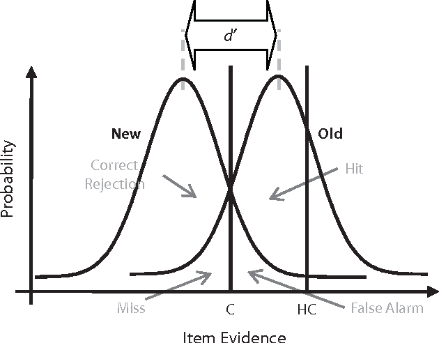

---
jupyter:
  jupytext:
    formats: ipynb,md
    text_representation:
      extension: .md
      format_name: markdown
      format_version: '1.1'
      jupytext_version: 1.2.1
  kernelspec:
    display_name: Julia 1.2.0
    language: julia
    name: julia-1.2
---

```
## Markov Chain Monte-Carlo (MCMC)

#### *15 November 2019*

#### *DATA 1010*

**Disclaimer:** This notebook's content is liberally borrowed from [A simple introduction to Markov Chain Monte–Carlo sampling](https://link.springer.com/article/10.3758/s13423-016-1015-8) written by van Ravenzwaaij et al.
```

```
using Plots, Random, LinearAlgebra, Statistics, Distributions
Random.seed!(1234);
```


```
## Introduction

MCMC is technique used to characterize a distribution in cases where the mathematical properties of the distribution are unknown or cannot be analytically determined. Specifically, MCMC can be used to draw samples from a distribution, when all we know about the distribution is how to calculate probability density for different samples. 

MCMC is the joint application of two techniques:

(1) Monte-Carlo: used to draw large number of samples from a distribution

(2) Markov Chain: generating samples of the distribution using a sequential process satisfying the Markov property, i.e. to draw the next sample, we only need to know the value of the current draw.

MCMC is invaluable in Bayesian learning because it allows us to estimate characteristics of the posterior distribution that cannot be easily calculated. In Bayesian inference, we update our belief about a set of parameters $\vec{\theta}$ based on observed data $D$:

$$ \mathbb{P}(\vec{\theta}|D) \propto \mathbb{P}(D|\vec{\theta})\mathbb{P}(\vec{\theta})$$

where $\mathbb{P}(\vec{\theta}|D)$ is the posterior probability and $\mathbb{P}(\vec{\theta})$ is the prior.

In practice, an analytical expression for the likelihood of data given the set of parameter values $\mathbb{P}(D|\vec{\theta})$ is often not available, thus making the estimation of the posterior distribution difficult. This problem can be addressed using MCMC, by drawing a sequence of samples from the posterior and using them to estimate properties of the posterior (mean, variance, etc.)
```

---

## Metropolis Algorithm

Lets run through a simple example to illustrate how MCMC works. Suppose we are asked to estimate the mean student score on an exam. Let us assume that scores are normally distributed with a standard deviation of $15$. Suppose we have only $1$ observation: someone scored $100$ on the exam. How do we estimate the mean?

In this case, we have an analytical expression for the posterior: $\mathcal{N}(100, 15)$. But, let us ignore this for the purpose of this example. We follow the following steps:

(1) Start with an initial *guess*: $110$

(2) Generate a *proposal* for the next sample by adding some random noise to the previous sample. This random noise is generated from a *proposal distribution*, which should be symmetric and centered on $0$. Let us assume that our proposal distribution is $\mathcal{N}(0,5)$. We draw $-2$ from this distribution, so our proposal is $108$.

(3) Compare the density of the posterior at the proposal with the density at the last sample. In this case we compare $\mathcal{N}(100|108,15)$ with $\mathcal{N}(100|110,15)$. 

(4) If the proposal has higher density value than the most recent sample, then accept the proposal.

(5) If the proposal has lower density value than the most recent sample, then accept the proposal with probability equal to the ratio of the two densities. For example, if the posterior at the new proposal value is one-fifth as high as the posterior of the most recent sample, then accept the new proposal with $20\%$ probability.

(6) If the new proposal is accepted, it becomes the next sample in the MCMC chain, otherwise the next sample in the MCMC chain is just a copy of the most recent sample.

(7) Repeat steps 2-6 to generate more samples.

(8) Stop when enough samples are generated to estimate the mean.

## Problem 1

Write Julia code to generate $500$ samples using the algorithm described above. Plot the density of the sampled values and the true density $\mathcal{N}(100, 15)$. Create another plot, with sample values on the y-axis and iteration number on the x-axis.

(a) Remake the plots starting with different initial guesses. Compare the plots obtained by starting near the mode of the true distribution ($110$), starting at the tail of the true distribution and starting far from the true distribution. What do you notice? 

(b) In principal, any symmetric proposal distribution should work, but in practice the choice of the proposal distribution can greatly influence the performance of the sampler. Change the standard deviation of the proposal distribution to $50$. What do you observe? What impact does this have on the rejection rate of your algorithm? 

(c) What happens if the standard deviation of the proposal distribution is too low (e.g. $1$)? Does the algorithm *converge*? Try different number of iterations.

(d) We used a symmetric proposal distribution. How would you modify the accept/reject step for an unsymmetric proposal distribution? (This modified algorithm is called the Metropolis-Hastings Algorithm)


---

In the previous problem, we diagnosed some limitations of the MCMC method:

(1) Starting values closer to the mode of the posterior converge faster. Therefore, starting with a good guess is important. In practice, it is difficult to find good starting points, but maximum likelihood estimate (MLE) can be used to identify candidates. We can also use an *ensemble* approach, by running multiple Markov chains to generate samples with different starting values.

(2 )The width of the proposal distribution is sometimes called the *tuning parameter* of the Metropolis-Hastings algorithm since it can greatly impact its performance. This can be overcome by using auto-tuning methods that adapt the width of the proposal distribution based on the observations. 

Next, we will consider a multi-variable parameter estimation problem.


---

## Problem 2

Consider a signal detection task: You enrol in a psychology experiment where you are asked to memorize a list of items. Once you have memorized the list, you are presented with another list of items. Your task is to identify whether each item is "new" (not seen before) or "old".

Your performance on this task can be quantified with parameters $C$ and $d'$:



Figure Credit: [Han and Dobbins](https://doi.org/10.3758/PBR.16.3.469)

where a "hit" is an event where you correctly recognize an old item and a "miss" is when you fail to recognize an old item. $C$ is the classification threshold and $d'$ is the sensitivity.

In this case the posterior distribution is bi-variate; that is, the posterior distribution is defined over all different combinations of $C$ and $d'$ values.

Assume that we run $200$ trials, with $100$ trials consisting of old items. You get $85$ hits and $12$ misses. Generate $500$ MCMC samples from the posterior distribution to estimate $C$ and $d'$.

```
num_samples = 500

N_trials_old = 100
N_trials_new = 100
num_hits = 85
num_misses = 12

# initial guess
C_init = 0.5
d_init = 1.0

function estimate_posterior_density(C, d, num_hits, num_misses, N_trials_old, N_trials_new)
    
    # calculate probability of hit
    
    # calculate probability of miss 
    
    # calculate log-likelihood of observing num_hits hits
    
    # calculate log-likelihood of observing num_misses misses
    
    # calculate log-likelihood of priors
    # assume N(0,4) prior for both parameters
    
    # return posterior density: exp(sum of log-likelihood)
      
end

# Metropolis algorithm

for itr in range(1, length=num_samples)
    
    # generate new proposal by adding noise from N(0, 0.1) for both params
    
    # calculate posterior density for the proposal
    
    # calculate posterior density for the prev sample
    
    # calculate ratio of densities
    
    # accept or reject the proposal
    
end
```

<!-- #region -->
---

## Gibbs Sampling

In the previous exercise, did you notice that the rate of convergence is very slow? This is because the model parameters are correlated. High values of $d'$ will tend to be sampled along with high values of $C$ and vice versa for low values. 


While correlated model parameters are, in theory, no problem for MCMC, in practice they can cause great difficulty. Correlations between parameters can lead to extremely slow convergence of sampling chains, and sometimes to non-convergence (at least, in a practical amount of sampling time). To overcome this limitation, a more sophisticated approach for generating and accepting/rejecting proposals is needed:

1. Choose starting values for both $d'$ and $C$, suppose these values are $1$ and $0.5$, respectively.

2. Generate a new proposal for $d'$, analogous to the second step in Metropolis sampling described above. Suppose the proposal is 1.2.

3. Accept the new proposal if it is more plausible to have come out of the population distribution than the present value of $d'$ , given the present $C$ value. So, given the $C$ value of $0.5$, accept the proposal of $d' = 1.2$ if that is a more likely value of $d'$ than $1$ for that specific $C$ value. Accept the new value with a probability equal to the ratio of the likelihood of the new $d'$ , $1.2$, and the present $d'$ , $1$, given a $C$ of $0.5$. Suppose the new proposal ($d' = 1.2$) is accepted.
 
4. Generate a new proposal for $C$. For this a second proposal distribution is needed. This example will use a second proposal distribution that is normal with zero mean and standard deviation of $0.1$. Suppose the new proposal for $C$ is $0.6$.

5. Accept the new proposal if it is more plausible to have come out of the population distribution than the $C$ value, given the present $d'$ value. So, given the $d'$ value of $1.2$, accept the proposal of $C = 0.6$ if that is a more likely value of $C$ than $0.5$ for that specific value of $d'$. Accept the new value with a probability equal to the ratio of the likelihood of the new $C$, $0.6$, and the present $C$, $0.5$, given a $d'$ of $1.2$. Suppose in this case that the proposal for $C$ ($0.6$) is rejected. Then the sample for $C$ stays at $0.5$.
 
6. This completes one iteration of Metropolis within Gibbs sampling. Return to step 2 to begin the next iteration.

---

## Problem 3

Implement Gibb's sampling for Problem 2.
<!-- #endregion -->

```

```
